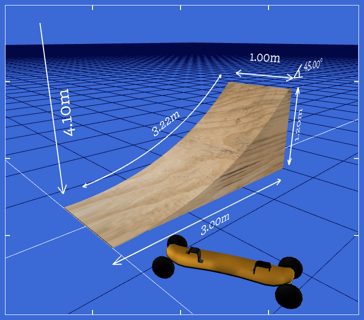

# Draw me a kicker!

## What is this?

An app for designing ramps (aka jumps, aka kickers) for mountainboarding, biking,
skateboarding and whatnot.

The target audience is the type of people who have experience with launching off of
these things, and who want to build a new one. They'll have an idea of how tall they
want the jump, and what kind of exit angle they'll want. Some people like flatter,
mellow jumps that are good for distance jumps, others will prefer steeper, floaty
jumps that are good for tricks.



## Running it

Requires Node 22+ and pnpm.

```sh
pnpm install
pnpm dev
```

Other scripts:

| Script           | What it does                                        |
| ---------------- | --------------------------------------------------- |
| `pnpm build`     | Static export into `out/`                           |
| `pnpm test`      | Geometry, unit and store tests (Vitest)             |
| `pnpm typecheck` | `tsc --noEmit`                                      |

## How it fits together

Phase 1 is a purely static frontend: `next.config.ts` sets `output: 'export'`, so
there is no server and no database yet.

- `src/lib/kicker` — the geometry. Arc radius, footprint, surface length, the side
  and surface outlines, strut placement, and unit formatting. No three.js, so it is
  unit-testable and reusable from the server in Phase 2.
- `src/store/editor-store.ts` — all editor state, including the four-state editor
  mode machine. Derived dimensions are computed by selector, never stored.
- `src/scene` — the react-three-fiber scene. One component per part, with the
  visibility truth table in `visibility.ts` and the orthographic bounding-box fit
  for the 2D blueprint view in `Cameras.tsx`.
- `src/components` — the UI: landing page, stepped sidebar, toolbar, and the stack
  of three canvases (WebGL scene, blueprint frame, and a hidden one for compositing
  PNG exports).

The editor is code-split behind `next/dynamic`: three.js and the XR runtime only
download once the visitor asks for the editor.

## Assets

`public/models/board.glb` is generated from the original Collada file:

```sh
pnpm assets:board
```

## Porting notes

The original app (Polymer 0.8, three.js r71, PHP, MySQL) is preserved under
`legacy/` for reference. It is not built or served, and it is not wired to
anything — it is there so the port can be checked against it.

Phase 2 will drop the static export to add the SQLite layer (Drizzle ORM) behind
`?id=` URLs, restoring save and load.
